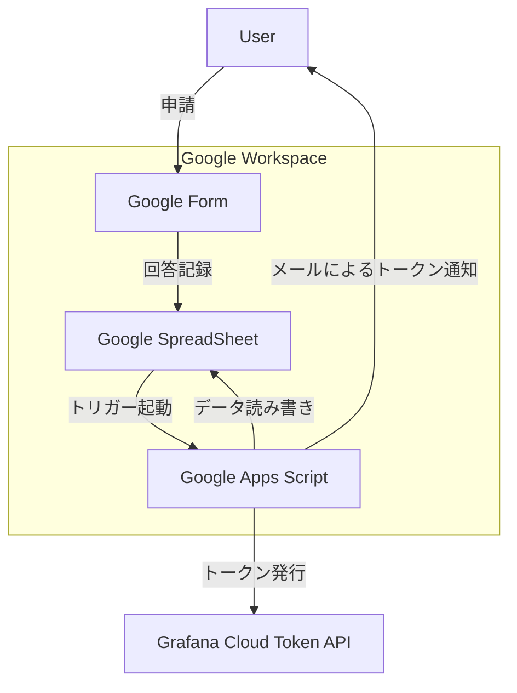

# Googleフォーム連携 Grafana Cloud トークン発行・通知システム

## 概要

この Google Apps Script (GAS) は、指定された Google フォームへの申請内容に基づき、Grafana Cloud の Access Policy Token API を自動的に呼び出し、発行されたトークン情報を申請者本人にメールで通知するとともに、処理結果を Google スプレッドシートに記録します。

これにより、トークン発行プロセスの効率化、迅速化、およびトレーサビリティの向上を目指します。



## 前提条件

  * **Google アカウント:** Google フォーム, Google スプレッドシート, Google Apps Script が利用可能であること。
  * **Grafana Cloud アカウント:**
      * トークン発行 API を呼び出す権限を持つ **API キー**。セキュリティのため、必要な最小限の権限(`accesspolicy:write`のみ)を持つキーを使用してください。
      * トークンを発行するアクセスポリシーの **Access Policy ID**。
      * Organizationに対応する **Region** (例: `prod-ap-northeast-0`)。
  * **Node.js:** `clasp` をインストール・実行するために必要。
  * **`@google/clasp`:** Google Apps Script 用のコマンドラインツール。[インストール手順](https://www.google.com/search?q=https://github.com/google/clasp%23install)

## セットアップ手順

1.  **リポジトリのクローン:**

    ```bash
    git clone https://github.com/hnw/grafana-cloud-token-issuer.git
    cd grafana-cloud-token-issuer
    ```

2.  **Google フォームの作成:**

      * 新規に Google フォームを作成します。
      * **設定:**
          * 「回答」タブ \> 「メールアドレスを収集する」: **「確認済み」** または **「回答者からの入力」** を選択します（「確認済み」を推奨）。
          * **重要:** フォームの設定で **「メールアドレスを収集する」を有効** にしてください。これにより、スクリプトは申請者のメールアドレスを `e.response.getRespondentEmail()` で取得しようとします。これが利用できない場合、他の方法（`e.namedValues['メールアドレス']` やスプレッドシートの特定列）で取得を試みます（ソースコード `COLUMN_EMAIL` 定数参照）。
          * 「設定」タブ \> 「回答」セクション \> 「ログインを必須にする」: **「\<あなたのドメイン\> のユーザーと信頼できる組織に限定する」** や **「1 回の回答に制限する」** を有効にすることを推奨します。
      * **質問:**
          * トークンの**有効期間**を選択する質問を追加します (例: プルダウン形式)。選択肢は `calculateExpirationDateISO` 関数が解釈できる形式 (例: "90日", "180日", "365日") にしてください。デフォルトは "30日" です。この質問に対応する列番号をソースコードの `COLUMN_EXPIRATION` 定数で指定します。
          * その他、申請に必要な情報があれば質問を追加します。

3.  **Google スプレッドシートの準備:**

      * 作成した Google フォームの「回答」タブで、「スプレッドシートにリンク」をクリックし、新しいスプレッドシートを作成します。
      * 作成されたスプレッドシートを開きます。フォームの回答が書き込まれる列（タイムスタンプ、メールアドレス、有効期限の回答など）に加えて、GAS が結果を書き込むための列を**手動で追加**します。**重要:** 列の順番はフォームの設定や変更によってずれる可能性があるため、必ず実際のシートに合わせてソースコード冒頭の `COLUMN_*` 定数を調整してください。デフォルト設定は以下の通りです:
          * B列 (2): メールアドレス (フォーム設定で自動収集される場合) - `COLUMN_EMAIL = 2`
          * C列 (3): 有効期限 (フォームの質問) - `COLUMN_EXPIRATION = 3`
          * **E列 (5): `処理ステータス`** (手動で追加) - `COLUMN_STATUS = 5`
          * **F列 (6): `発行トークン名`** (手動で追加) - `COLUMN_TOKEN_NAME = 6`
          * **G列 (7): `トークン有効期限`** (手動で追加) - `COLUMN_EXPIRES_AT = 7`
          * **H列 (8): `エラー詳細`** (手動で追加) - `COLUMN_ERROR_DETAILS = 8`

4.  **`clasp` による連携とデプロイ:**

      * 上記のスプレッドシートのID（URL中の `.../d/` と `/edit` の間の文字列）をコピーします。
      * ローカルのリポジトリディレクトリで以下のコマンドを実行します:
        ```bash
        clasp login # Googleアカウントで認証
        clasp create-script --title "Grafana Cloud Token Issuer" --rootDir ./src --parentId "<スプレッドシートのID>"
        git checkout -- src/appsscript.json
        clasp push # GASプロジェクトにコードをアップロード
        ```

5.  **Apps Scriptの設定:**

      * `clasp open-script` でスクリプトエディタを開きます。
      * 左メニューの「プロジェクトの設定」(歯車アイコン) をクリックします。
      * 「スクリプト プロパティ」セクションで、「スクリプト プロパティを編集」をクリックし、以下のキーと値を追加します:
          * `GRAFANA_CLOUD_API_KEY`: (あなたの Grafana API キー) - **必須**
          * `GRAFANA_CLOUD_ACCESS_POLICY_ID`: (トークンを発行したい Grafana Cloud Access Policy ID) - **必須**
          * `GRAFANA_CLOUD_REGION`: (あなたのアカウントに紐づくリージョン。例: `prod-ap-northeast-0`) - **必須**
          * `ADMIN_EMAIL`: (エラー通知を受け取る管理者のメールアドレス) - **任意**
          * `SUCCESS_EMAIL_FROM`: (成功通知メールの送信元アドレスとして表示したいアドレス) - **任意** (設定しない場合、スクリプト実行者のアドレスが使われることがあります)
          * `SUCCESS_EMAIL_NAME`: (成功通知メールの送信者名として表示したい名前) - **任意**
      * 「スクリプト プロパティを保存」をクリックします。

6.  **トリガーの設定:**

      * スクリプトエディタの左メニューの「トリガー」(時計アイコン) を選択します。
      * 「＋ トリガーを追加」をクリックし、以下のように設定します:
          * 実行する関数: `onFormSubmit`
          * 実行するデプロイ: `Head`
          * イベントのソース: `スプレッドシートから`
          * イベントの種類: `フォーム送信時`
      * 「保存」をクリックします。**初回保存時に権限の承認を求められます。** スクリプトが Google スプレッドシートへのアクセス、外部サービスへの接続 (Grafana API)、メール送信を行うことを許可してください。内容をよく確認し、問題なければ「許可」をクリックします。

## 使い方

1.  設定済みの Google フォームにアクセスし、必要事項 (特に有効期限) を入力して送信します。
2.  フォーム送信後、しばらくすると (通常は数秒～数十秒)、`onFormSubmit` トリガーが起動し、GAS が実行されます。
3.  処理が成功すると、申請者のメールアドレスにトークン情報と注意喚起を含むメールが送信されます。
4.  処理結果 (成功/失敗、発行トークン名、有効期限、エラー詳細など) が連携された Google スプレッドシートの該当行に自動的に記録されます（`COLUMN_*` で指定された列）。
5.  処理中にエラーが発生した場合、スプレッドシートに「失敗」とエラー詳細が記録され、`ADMIN_EMAIL` が設定されていれば管理者にエラー通知メールが送信されます。詳細なエラー内容は GAS の実行ログ (`表示` \> `実行内容` または `Cloud Logs` で確認可能) で確認できます。

## 設定項目 (スクリプトプロパティ)

以下の項目は、GAS スクリプトエディタの「プロジェクトの設定」\>「スクリプト プロパティ」で設定する必要があります。

  * `GRAFANA_CLOUD_API_KEY` (**必須**): トークン発行に使うアクセスポリシートークン。`accesspolicy:write`スコープが必要。
  * `GRAFANA_CLOUD_ACCESS_POLICY_ID` (**必須**): トークン発行対象のアクセスポリシーに紐づくID。例えばログ書き込み用のトークンを発行したい場合は`log:write`スコープを持つアクセスポリシーID。
  * `GRAFANA_CLOUD_REGION` (**必須**): アクセスポリシーが存在する Grafana Cloud のリージョン (例: `prod-ap-northeast-0`)。
  * `ADMIN_EMAIL` (任意): スクリプト実行中にエラーが発生した場合に通知を受け取る管理者のメールアドレス。設定しない場合、エラー通知は送信されません。
  * `SUCCESS_EMAIL_FROM` (任意): 成功通知メールの `From:` ヘッダーに設定されるメールアドレス。設定しない場合、GASのオーナーのメールアドレスになります。設定するメールアドレスは、GASのオーナーのエイリアスアドレスである必要があります。
  * `SUCCESS_EMAIL_NAME` (任意): 成功通知メールの送信者名。（例: "Grafana Cloudトークン発行システム"）

## コード内の主要な設定箇所 (要確認・修正)

  * **スクリプトファイル冒頭:**
      * `COLUMN_*` 定数群: スプレッドシートの列番号です。**実際のフォームとスプレッドシートの構成に合わせて必ず確認・修正してください。** 特にメールアドレス(`COLUMN_EMAIL`)と有効期限(`COLUMN_EXPIRATION`)の列はフォームの構成に依存します。
      * `DEFAULT_EXPIRATION_DAYS`: フォームで有効期限が指定されなかったり、正しく読み取れなかった場合のデフォルトの有効日数。
  * **`calculateExpirationDateISO` 関数内:**
      * 有効期限文字列のパースロジック (`match(/(\d+)\s*日/)`)。フォームの有効期限選択肢の**形式** (例: "90日", "180日", "365日") に合わせて、正規表現やパースロジックを修正する必要があるかもしれません。

## 注意点

  * **API キーの管理:** `GRAFANA_CLOUD_API_KEY` は機密情報です。スクリプトプロパティに設定し、コード内に直接記述しないでください。キーの漏洩に注意し、必要最低限の権限を付与したキーを使用し、定期的なローテーションを検討してください。
  * **スプレッドシート列の依存性:** スクリプトは特定の列番号 (`COLUMN_*` 定数) に依存して動作します。フォームの質問順を変更したり、スプレッドシートの列を挿入・削除したりした場合は、**必ずスクリプト内の定数を更新**してください。
  * **GAS の制限:** Google Apps Script には実行時間、API 呼び出し回数、メール送信数などのクォータ（制限）があります。短時間に大量の申請が見込まれる場合は、これらの制限に抵触しないか注意が必要です。[Google Apps Script quotas](https://developers.google.com/apps-script/guides/services/quotas)
  * **エラーハンドリング:** 基本的なエラーハンドリングは実装されていますが、ネットワーク不安定時のリトライ処理などは含まれていません。エラー発生時は GAS の実行ログやスプレッドシートの記録を確認してください。
  * **メールの注意喚起:** 発行されたトークンキーは非常に機密性が高いです。申請者に送信されるメールには、その取り扱いに関する強い注意喚起が含まれていますが、組織内での利用者への周知徹底が重要です。

## ライセンス

MIT License
